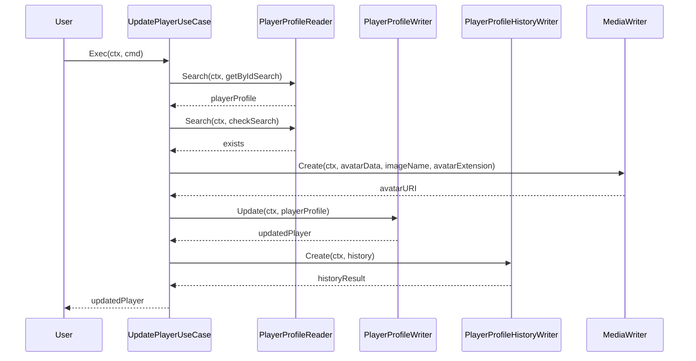

### `NewUpdatePlayerUseCase`
```go
func NewUpdatePlayerUseCase(
  playerProfileReader squad_in.PlayerProfileReader,
  playerProfileWriter squad_out.PlayerProfileWriter,
  playerHistoryWriter squad_out.PlayerProfileHistoryWriter,
  mediaWriter media_out.MediaWriter,
) *UpdatePlayerUseCase
```
Creates a new instance of `UpdatePlayerUseCase` with the provided dependencies.

#### Parameters
- `playerProfileReader`: Interface for reading player profiles.
- `playerProfileWriter`: Interface for writing player profiles.
- `playerHistoryWriter`: Interface for writing player profile history.
- `mediaWriter`: Interface for handling media operations.

#### Returns
- `*UpdatePlayerUseCase`: A new instance of `UpdatePlayerUseCase`.

### `Exec`
```go
func (uc *UpdatePlayerUseCase) Exec(ctx context.Context, cmd squad_in.UpdatePlayerCommand) (*squad_entities.PlayerProfile, error)
```
Executes the update player use case. It performs the following steps:

1. **Authentication Check**: Verifies if the user is authenticated.
2. **Profile Search**: Searches for the player profile by ID using `PlayerProfileReader`.
3. **Ownership Validation**: Validates the resource ownership to ensure the user has permission to update the profile.
4. **Uniqueness Check**: Checks for the uniqueness of the nickname and slug URI to avoid conflicts.
5. **Avatar Update**: Updates the player's avatar if a new one is provided using `MediaWriter`.
6. **Profile Update**: Updates the player's profile with the new data using `PlayerProfileWriter`.
7. **History Logging**: Logs the update action in the player's history using `PlayerProfileHistoryWriter`.

#### Parameters
- `ctx`: The context for managing request-scoped values, cancellation, and deadlines.
- `cmd`: The command containing the data required to update the player profile.

#### Returns
- `*squad_entities.PlayerProfile`: The updated player profile.
- `error`: An error object if an error occurred during the execution.

## Mermaid Diagram
