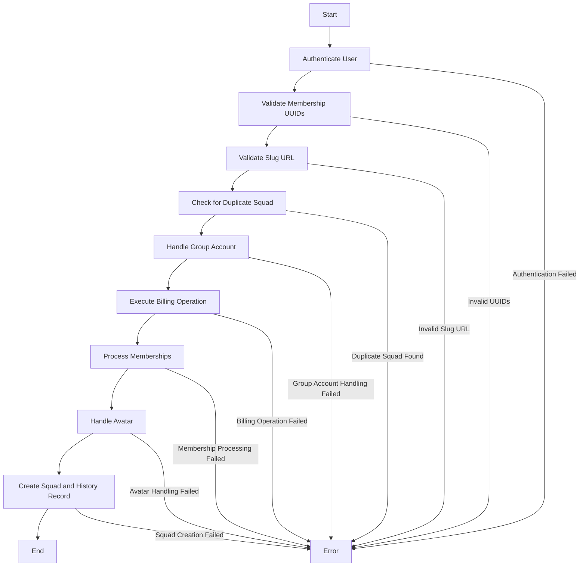

## CreateSquadUseCase
The `CreateSquadUseCase` struct is responsible for handling the creation of a new squad. It interacts with various domain services and performs multiple validation checks to ensure the squad is created correctly.

### Fields

- `billableOperationHandler`: Handles billing operations related to squad creation.
- `SquadWriter`: Writes squad data to the storage.
- `SquadReader`: Reads squad data from the storage.
- `GroupWriter`: Writes group data to the storage.
- `GroupReader`: Reads group data from the storage.
- `SquadHistoryWriter`: Writes squad history data to the storage.
- `PlayerProfileReader`: Reads player profile data.
- `MediaWriter`: Writes media data (e.g., squad avatars).

### NewCreateSquadUseCase

Creates a new instance of `CreateSquadUseCase`.

#### Parameters

- `squadWriter`: An instance of `SquadWriter`.
- `squadHistoryWriter`: An instance of `SquadHistoryWriter`.
- `squadReader`: An instance of `SquadReader`.
- `groupWriter`: An instance of `GroupWriter`.
- `groupReader`: An instance of `GroupReader`.
- `playerProfileReader`: An instance of `PlayerProfileReader`.
- `mediaWriter`: An instance of `MediaWriter`.
- `billableOperationHandler`: An instance of `BillableOperationCommandHandler`.

#### Returns

- A new instance of `CreateSquadUseCase`.

### Exec

Creates a new squad based on the provided command and context. It performs several validation checks and operations, including:

1. **Authentication**: Ensures the user is authenticated.
2. **Membership UUID Validation**: Validates the UUIDs of the squad members.
3. **Slug URL Validation**: Validates the slug URL of the squad.
4. **Duplicate Squad Check**: Checks if a squad with the same SlugURI or Name already exists.
5. **Group Account Handling**: Creates or retrieves a group account for the user.
6. **Billing Operation**: Validates and executes a billing operation for creating the squad.
7. **Membership Handling**: Processes and validates squad memberships.
8. **Avatar Handling**: Processes the squad's avatar if provided.
9. **Squad Creation**: Creates the squad and its history record.

#### Parameters

- `ctx`: The context for the operation, which includes authentication and other metadata.
- `cmd`: The command containing the details for creating or updating the squad.

#### Returns

- A pointer to the created squad entity.
- An error if any validation or operation fails.

### ValidateSlugURL

Validates the slug URL of the squad.

#### Parameters

- `slugURI`: The slug URL to be validated.

#### Returns

- An error if the slug URL is invalid.

### ValidateMembershipUUIDs

Validates the UUIDs of the squad members.

#### Parameters

- `members`: A map of member UUIDs to `CreateSquadMembershipInput`.

#### Returns

- An error if any UUID is invalid.

### Business Flow Diagram

