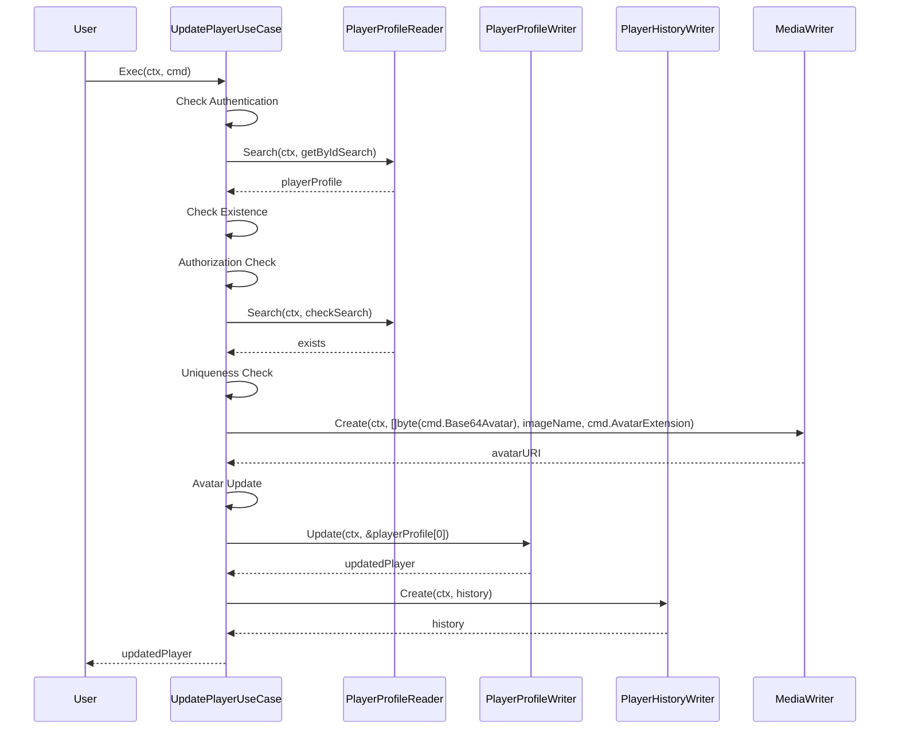

## UpdatePlayerUseCase

`UpdatePlayerUseCase` is a use case for updating a player's profile. It reads the player's profile, validates the update command, and writes the updated profile and history.

### Fields

- `PlayerProfileReader`: Reads player profiles.
- `PlayerProfileWriter`: Writes player profiles.
- `PlayerHistoryWriter`: Writes player profile history.
- `MediaWriter`: Writes media files.

### NewUpdatePlayerUseCase

Creates a new instance of `UpdatePlayerUseCase`.

```go
func NewUpdatePlayerUseCase(
  playerProfileReader squad_in.PlayerProfileReader,
  playerProfileWriter squad_out.PlayerProfileWriter,
  playerHistoryWriter squad_out.PlayerProfileHistoryWriter,
  mediaWriter media_out.MediaWriter,
) *UpdatePlayerUseCase
```

### Exec

Executes the update player profile command. It validates the command, checks for existing profiles with the same nickname or slug URI, updates the player's profile, and writes the update to the history.

```go
func (uc *UpdatePlayerUseCase) Exec(ctx context.Context, cmd squad_in.UpdatePlayerCommand) (*squad_entities.PlayerProfile, error)
```

#### Steps

1. **Check Authentication**: Verifies if the user is authenticated.
2. **Search Player Profile**: Searches for the player profile by ID.
3. **Check Existence**: Ensures the player profile exists.
4. **Authorization Check**: Confirms the user is authorized to update the profile.
5. **Uniqueness Check**: Checks for existing profiles with the same nickname or slug URI.
6. **Avatar Update**: Handles avatar update if provided.
7. **Profile Update**: Updates the player's profile with the new data.
8. **Database Write**: Writes the updated profile to the database.
9. **History Record**: Creates a history record for the update.

#### Example

```go
ctx := context.Background()
cmd := squad_in.UpdatePlayerCommand{
  PlayerID:       uuid.New(),
  Nickname:       "NewNickname",
  SlugURI:        "new-slug-uri",
  Roles:          []string{"role1", "role2"},
  Description:    "New description",
  Base64Avatar:   "base64encodedstring",
  AvatarExtension: ".png",
}

useCase := NewUpdatePlayerUseCase(playerProfileReader, playerProfileWriter, playerHistoryWriter, mediaWriter)
updatedPlayer, err := useCase.Exec(ctx, cmd)
if err != nil {
  log.Fatal(err)
}
fmt.Println("Updated player profile:", updatedPlayer)
```

### Sequence Diagram


