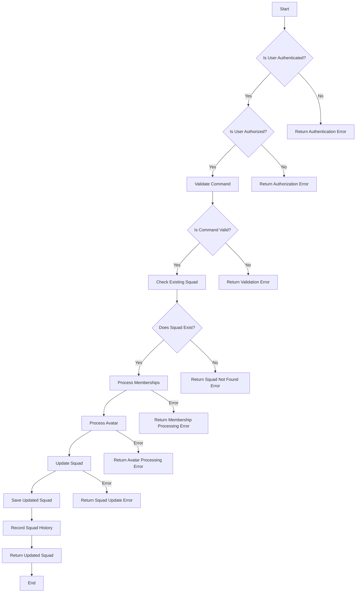

# UpdateSquadUseCase

## Overview

The `UpdateSquadUseCase` is responsible for handling the update operations for a squad. It ensures that the user is authenticated, authorized, and that the provided data is valid before updating the squad's information. This use case also handles the processing of squad memberships and avatar updates.

## Business Rules

### Authentication

- The user must be authenticated to perform the update operation.
- The authentication status is checked using the `isAuthenticated` method which retrieves the authentication status from the context.
- If the user is not authenticated, an authentication error is returned.

### Authorization

- The user must be authorized to update the squad.
- Authorization is determined by checking if the user is the resource owner or has the role of `Owner` or `Admin` within the squad.
- If the user is not authorized, an authorization error is returned.

### Validation

- The command must be validated before processing.
- The `validateCommand` method checks the following:
  - Membership UUIDs must be valid.
  - The `SlugURI` must be a valid URL.
- If the command is not valid, a validation error is returned.

### Existing Squad Check

- The squad must exist to be updated.
- The `getExistingSquad` method checks for the existence of the squad by `SlugURI` and `Name`.
- If the squad does not exist, a squad not found error is returned.

### Membership Processing

- The `processMemberships` method handles the processing of squad memberships.
- It ensures that each member's profile exists and updates the membership details accordingly.
- Memberships are updated with roles, types, and statuses.
- Squad history is recorded for membership changes such as additions, promotions, and demotions.
- If any membership processing fails, an error is returned.

### Avatar Processing

- The `processAvatar` method handles the processing of the squad's avatar.
- If a new avatar is provided in base64 format, it is saved and the URI is returned.
- If avatar processing fails, an error is returned.

### Squad Update

- The `updateSquad` method updates the squad's details including name, symbol, description, game ID, logo URI, and memberships.
- The updated squad is saved and squad history is recorded for the update.
- If the update fails, an error is returned.

## Methods

### `Exec`

- Main method to execute the update squad use case.
- Parameters:
  - `ctx`: Context for the operation.
  - `squadID`: UUID of the squad to be updated.
  - `cmd`: Command containing the updated squad details.
- Returns:
  - Updated squad entity.
  - Error if any validation or processing fails.

### `isAuthenticated`

- Checks if the user is authenticated.
- Returns:
  - `true` if authenticated, `false` otherwise.

### `validateCommand`

- Validates the command for updating the squad.
- Returns:
  - Error if validation fails.

### `getExistingSquad`

- Retrieves the existing squad by ID.
- Returns:
  - Existing squad entity.
  - Error if the squad does not exist.

### `checkSquadExists`

- Checks if a squad exists based on the search criteria.
- Returns:
  - Error if the squad already exists.

### `processMemberships`

- Processes the squad memberships.
- Returns:
  - Map of processed memberships.
  - Error if any membership processing fails.

### `processAvatar`

- Processes the squad's avatar.
- Returns:
  - URI of the processed avatar.
  - Error if avatar processing fails.

### `updateSquad`

- Updates the squad details.
- Returns:
  - Updated squad entity.
  - Error if the update fails.

### `convertMembershipMapToSlice`

- Converts the membership map to a slice.
- Returns:
  - Slice of squad memberships.

### `isUserAuthorized`

- Checks if the user is authorized to update the squad.
- Returns:
  - `true` if authorized, `false` otherwise.

### `GetPromotedOrDemotedStatus`

- Determines if a member is promoted or demoted.
- Returns:
  - Squad history action indicating promotion or demotion.

## Usage

To use the `UpdateSquadUseCase`, create an instance by providing the necessary dependencies and call the `Exec` method with the appropriate parameters.

