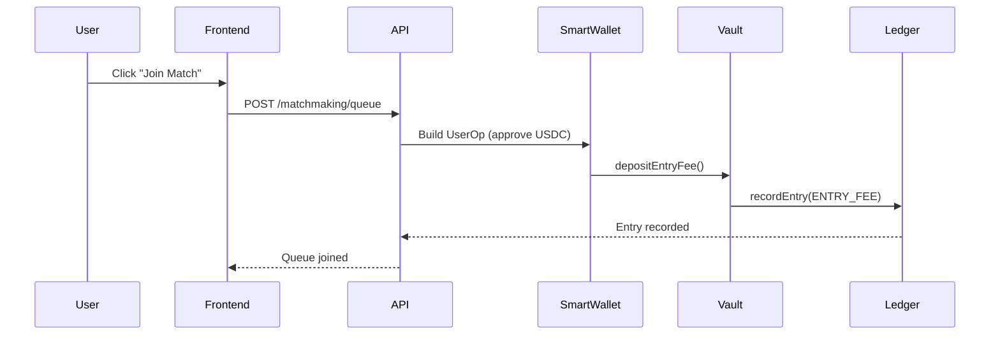
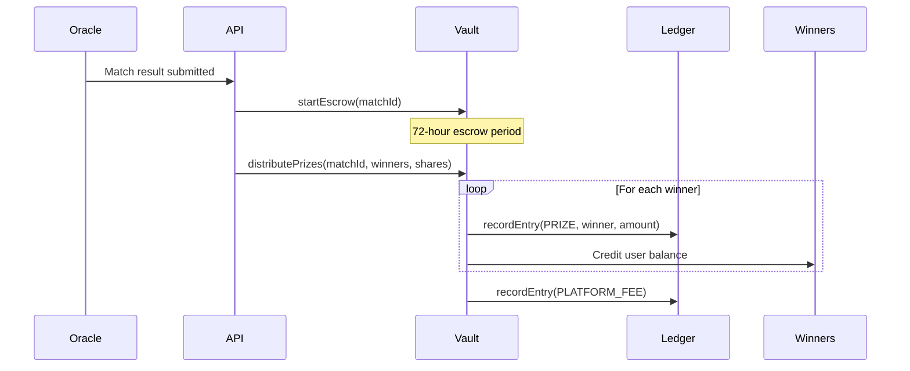
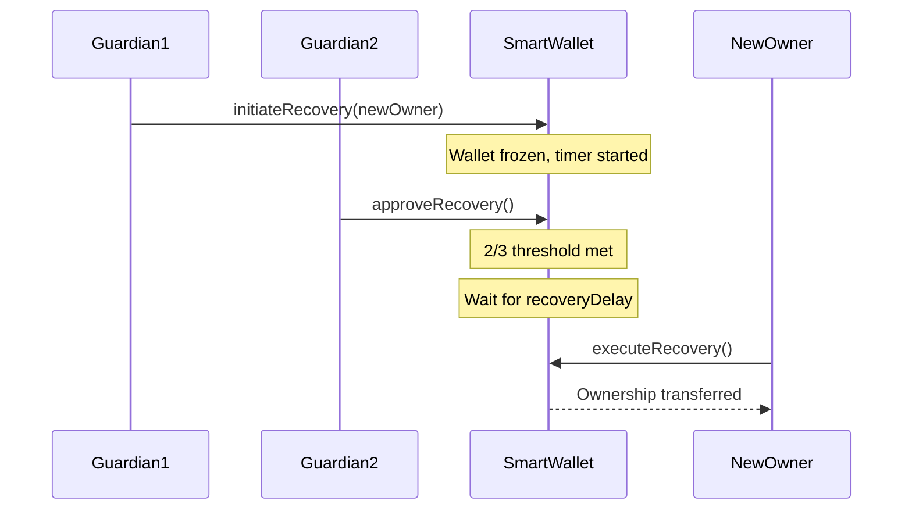

# LeetGaming PRO - Blockchain Architecture

## Executive Summary

LeetGaming PRO implements a **banking-grade blockchain infrastructure** supporting multi-chain operations across Solana and EVM-compatible networks. The system is designed for high-value esports prize pools, real-time transaction processing, and institutional-level security.

**Target Market Value Enablers:**
- Non-custodial smart wallets with MPC security
- Zero-gas transactions for users (paymaster sponsorship)
- Immutable audit trail (blockchain ledger)
- Multi-chain prize pool management
- Social recovery and spending limits

---

## Architecture Overview

```
┌─────────────────────────────────────────────────────────────────────────────┐
│                     LeetGaming PRO Blockchain Stack                         │
├─────────────────────────────────────────────────────────────────────────────┤
│                                                                             │
│  ┌─────────────────────────────────────────────────────────────────────┐   │
│  │                      Frontend (Next.js)                              │   │
│  │  ┌──────────────┐ ┌──────────────┐ ┌──────────────┐                 │   │
│  │  │ Wallet SDK   │ │ Payment SDK  │ │ Prize SDK   │                 │   │
│  │  └──────────────┘ └──────────────┘ └──────────────┘                 │   │
│  └─────────────────────────────────────────────────────────────────────┘   │
│                                    │                                        │
│  ┌─────────────────────────────────▼───────────────────────────────────┐   │
│  │                      REST API (Go 1.23)                              │   │
│  │  ┌──────────────────────────────────────────────────────────────┐   │   │
│  │  │                   Domain Layer (DDD)                          │   │   │
│  │  │  ┌────────────┐ ┌────────────┐ ┌────────────┐ ┌────────────┐ │   │   │
│  │  │  │ Blockchain │ │  Custody   │ │   Wallet   │ │  Billing   │ │   │   │
│  │  │  │  Domain    │ │  Domain    │ │  Domain    │ │  Domain    │ │   │   │
│  │  │  │ (99%+cov)  │ │ (97%+cov)  │ │ (94%+cov)  │ │  (TBD)     │ │   │   │
│  │  │  └────────────┘ └────────────┘ └────────────┘ └────────────┘ │   │   │
│  │  └──────────────────────────────────────────────────────────────┘   │   │
│  └─────────────────────────────────────────────────────────────────────┘   │
│                                    │                                        │
│  ┌─────────────────────────────────▼───────────────────────────────────┐   │
│  │                    Smart Contracts Layer                             │   │
│  │  ┌─────────────────────────────────────────────────────────────┐    │   │
│  │  │                    EVM Contracts (Solidity)                  │    │   │
│  │  │  ┌────────────┐ ┌────────────┐ ┌────────────┐ ┌───────────┐ │    │   │
│  │  │  │LeetLedger  │ │ LeetVault  │ │LeetSmartWlt│ │LeetPaymstr│ │    │   │
│  │  │  │(97.4%cov)  │ │ (88.8%cov) │ │(88.3%cov)  │ │(98.9%cov) │ │    │   │
│  │  │  └────────────┘ └────────────┘ └────────────┘ └───────────┘ │    │   │
│  │  └─────────────────────────────────────────────────────────────┘    │   │
│  │  ┌─────────────────────────────────────────────────────────────┐    │   │
│  │  │                  Solana Programs (Anchor)                    │    │   │
│  │  │  ┌────────────┐ ┌────────────┐ ┌────────────┐               │    │   │
│  │  │  │LeetWallet  │ │LeetVault   │ │LeetLedger  │ (Planned)     │    │   │
│  │  │  └────────────┘ └────────────┘ └────────────┘               │    │   │
│  │  └─────────────────────────────────────────────────────────────┘    │   │
│  └─────────────────────────────────────────────────────────────────────┘   │
│                                    │                                        │
│  ┌─────────────────────────────────▼───────────────────────────────────┐   │
│  │                        Blockchain Networks                           │   │
│  │  ┌──────────────────────────┐  ┌──────────────────────────────┐     │   │
│  │  │      EVM Networks        │  │      Solana Networks         │     │   │
│  │  │  • Polygon (Primary)     │  │  • Mainnet (Primary)         │     │   │
│  │  │  • Base (L2)             │  │  • Devnet (Testing)          │     │   │
│  │  │  • Arbitrum (L2)         │  │                              │     │   │
│  │  │  • Ethereum (Settlement) │  │                              │     │   │
│  │  │  • Optimism (L2)         │  │                              │     │   │
│  │  └──────────────────────────┘  └──────────────────────────────┘     │   │
│  └─────────────────────────────────────────────────────────────────────┘   │
│                                                                             │
└─────────────────────────────────────────────────────────────────────────────┘
```

---

## Smart Contracts

### 1. LeetLedger - Immutable Financial Ledger

**Purpose:** Banking-grade double-entry accounting on-chain.

**Key Features:**
- Append-only transaction recording
- Merkle tree chain integrity verification
- Batch recording for gas efficiency
- Transaction categories: DEPOSIT, WITHDRAWAL, ENTRY_FEE, PRIZE, REFUND, PLATFORM_FEE, TRANSFER
- Per-account running balances
- Audit trail with cryptographic proofs

**Test Coverage:** 97.44% (37 tests)

```solidity
// Key Functions
recordEntry(transactionId, account, token, amount, category, matchId, tournamentId)
recordBatch(batchId, transactionIds[], accounts[], tokens[], amounts[], categories[], matchIds[])
recordTransfer(transactionId, fromAccount, toAccount, token, amount, category, matchId)
verifyChainIntegrity(startIndex, endIndex)
generateEntryProof(entryIndex)
```

### 2. LeetVault - Prize Pool Escrow

**Purpose:** Secure prize pool management with escrow mechanism.

**Key Features:**
- Pool lifecycle: NotCreated → Accumulating → Locked → InEscrow → Distributed
- Multi-token support (USDC, USDT)
- Platform contribution per match
- Configurable platform fee (basis points)
- 72-hour escrow period (configurable)
- Automated refunds on cancellation

**Test Coverage:** 88.78% (22 tests)

```solidity
// Prize Pool Lifecycle
createPrizePool(matchId, token, entryFee, platformFeePercent)
depositEntryFee(matchId)
lockPrizePool(matchId)
startEscrow(matchId)
distributePrizes(matchId, winners[], shares[])
cancelPrizePool(matchId)
```

### 3. LeetSmartWallet - ERC-4337 Account Abstraction

**Purpose:** Non-custodial smart wallets with MPC security.

**Key Features:**
- ERC-4337 compliant (UserOperation validation)
- MPC-derived owner (threshold signatures)
- Social recovery with guardian system (up to 7 guardians)
- Session keys for delegated signing
- Daily spending limits with auto-reset
- Emergency freeze/unfreeze
- ERC-1271 signature validation
- UUPS upgradeable

**Test Coverage:** 88.28% (36 tests)

```solidity
// Core Functions
initialize(walletId, owner, entryPoint, dailyLimit, recoveryDelay)
validateUserOp(userOp, userOpHash, missingAccountFunds)
execute(target, value, data)
executeBatch(targets[], values[], datas[])

// Guardian Management
addGuardian(guardian, guardianType)
removeGuardian(guardian)
setGuardianThreshold(threshold)

// Recovery
initiateRecovery(newOwner)
approveRecovery()
executeRecovery()
cancelRecovery()

// Session Keys
addSessionKey(key, validAfter, validUntil, spendingLimit, allowedTokens[])
revokeSessionKey(key)
```

### 4. LeetPaymaster - Gas Sponsorship

**Purpose:** Enable gasless transactions for users.

**Key Features:**
- Multiple payment modes:
  - **Sponsored:** Platform pays (for specific operations)
  - **GasCredits:** Pre-purchased gas credits
  - **TokenPayment:** Pay in USDC/USDT
  - **VerifiedFree:** Signed free transactions
- Rate limiting (abuse prevention)
- Daily usage tracking
- Token price oracles

**Test Coverage:** 98.91% (60 tests)

```solidity
// Paymaster Interface
validatePaymasterUserOp(userOp, userOpHash, maxCost)
postOp(mode, context, actualGasCost, actualUserOpFeePerGas)

// Configuration
setSponsorship(wallet, dailyLimit, perTxLimit, allowedTargets[])
addGasCredits(wallet, amount)
setTokenPrice(token, price)
```

---

## Multi-Chain Architecture

### Chain ID Standards

We use **CAIP-2** (Chain Agnostic Improvement Proposal) for chain identification:

| Chain | CAIP-2 ID | Type | Primary Use |
|-------|-----------|------|-------------|
| Solana Mainnet | `solana:mainnet` | Solana | Low fees, fast finality |
| Polygon | `eip155:137` | EVM | Primary EVM chain |
| Base | `eip155:8453` | EVM (L2) | Low gas, Coinbase ecosystem |
| Arbitrum | `eip155:42161` | EVM (L2) | Low gas, DeFi integration |
| Ethereum | `eip155:1` | EVM | Settlement, high-value |
| Optimism | `eip155:10` | EVM (L2) | OP Stack ecosystem |

### Asset Identification (CAIP-19)

```
Format: {chain_id}/{token_standard}:{token_address}

Examples:
- USDC on Solana: solana:mainnet/spl:EPjFWdd5AufqSSqeM2qN1xzybapC8G4wEGGkZwyTDt1v
- USDC on Polygon: eip155:137/erc20:0x3c499c542cEF5E3811e1192ce70d8cC03d5c3359
- USDC on Base: eip155:8453/erc20:0x833589fCD6eDb6E08f4c7C32D4f71b54bdA02913
```

---

## Custody & MPC Architecture

### Multi-Party Computation (MPC) Key Management

```
┌─────────────────────────────────────────────────────────────────┐
│                    MPC Key Generation                            │
│                                                                  │
│  ┌──────────────┐    ┌──────────────┐    ┌──────────────┐       │
│  │   Party 1    │    │   Party 2    │    │   Party 3    │       │
│  │  (Platform)  │    │   (User)     │    │   (HSM)      │       │
│  │  Share A     │    │  Share B     │    │  Share C     │       │
│  └──────┬───────┘    └──────┬───────┘    └──────┬───────┘       │
│         │                    │                    │              │
│         └────────────────────┼────────────────────┘              │
│                              │                                   │
│                    ┌─────────▼─────────┐                        │
│                    │  Aggregated Key   │                        │
│                    │  (Never exposed)  │                        │
│                    └───────────────────┘                        │
└─────────────────────────────────────────────────────────────────┘
```

**Supported MPC Schemes:**
- **CMP (GG20)**: For secp256k1 (EVM chains) - Fast 2-of-3 threshold
- **FROST-Ed25519**: For Ed25519 (Solana) - Schnorr-based threshold

**Key Types:**
- **Master Key**: Main transaction signing key
- **Recovery Key**: Used only during social recovery
- **Session Key**: Temporary delegated key for gaming sessions

### Hardware Security Module (HSM) Integration

- **FIPS 140-2 Level 3** compliant
- Key share storage and signing operations
- Audit logging for all operations
- Geographic distribution for resilience

---

## Zero-Knowledge Proof (ZKP) Opportunities

### Current Implementation: None

### Proposed ZKP Integration

#### 1. Privacy-Preserving Leaderboards (ZK-SNARKs)

**Problem:** Players want to prove their ranking without revealing exact stats.

**Solution:**
```
Prove: "My K/D ratio is in top 10%" without revealing: actual K/D value

Circuit:
- Private inputs: player_stats, rank_threshold
- Public inputs: leaderboard_merkle_root, player_address
- Output: boolean (is_in_top_n_percent)
```

#### 2. Scalable Batch Operations (ZK-Rollups)

**Problem:** High gas costs for recording many ledger entries.

**Solution:**
- Batch 100+ transactions off-chain
- Generate ZK proof of valid state transition
- Submit single on-chain proof

**Benefits:**
- 100x gas reduction
- Same security guarantees
- Faster finality for users

#### 3. Private Tournament Brackets

**Problem:** Players want to verify match results without revealing strategies.

**Solution:**
```
Prove: "Team A won with valid gameplay" without revealing: player positions, strategies

Circuit:
- Private inputs: replay_data, team_stats
- Public inputs: match_id, winner_address
- Output: validity_proof
```

#### 4. Cross-Chain Asset Verification

**Problem:** Verify asset ownership across chains without bridging.

**Solution:**
- ZK proof of balance on source chain
- Verify proof on destination chain
- No actual token movement required

### Recommended ZKP Stack

| Component | Technology | Purpose |
|-----------|------------|---------|
| Proving System | Groth16 / Plonk | Efficient verification |
| Framework | Circom / Noir | Circuit development |
| Prover | SnarkJS / Aztec | Proof generation |
| Verifier | Solidity contract | On-chain verification |

---

## Transaction Flow Examples

### 1. Join Ranked Match (EVM)



### 2. Prize Distribution (Multi-Winner)



### 3. Social Recovery Flow



---

## Security Considerations

### Smart Contract Security

| Control | Implementation |
|---------|----------------|
| Access Control | OpenZeppelin AccessControl roles |
| Reentrancy | ReentrancyGuard on all external calls |
| Pausability | Emergency pause on critical functions |
| Upgradability | UUPS pattern with owner-only authorization |
| Signature Validation | ECDSA + EIP-712 typed data |

### Custody Security

| Control | Implementation |
|---------|----------------|
| Key Distribution | 2-of-3 MPC threshold signing |
| Cold Storage | HSM for key share storage |
| Session Limits | Time-bound session keys with spending caps |
| Freeze Mechanism | Instant wallet freeze by owner or guardian |
| Recovery Delay | Configurable delay before ownership transfer |

### Compliance Targets

| Standard | Status | Notes |
|----------|--------|-------|
| SOX | ✅ In Progress | Immutable ledger provides audit trail |
| PCI-DSS | 🔄 Planned | Token handling requires encryption |
| GDPR | 🔄 Planned | On-chain data minimization |
| MiCA | 📋 Planned | EU crypto asset regulation |

---

## Deployment Strategy

### Contract Deployment Order

1. **LeetLedger** - Deploy first (no dependencies)
2. **LeetVault** - Deploy with treasury address
3. **LeetPaymaster** - Deploy with EntryPoint address
4. **LeetSmartWallet** - Deploy factory with all addresses

### Multi-Chain Deployment

```
Primary Chains (Launch):
├── Polygon (Primary EVM)
├── Base (L2 Alternative)
└── Solana (Primary Solana)

Secondary Chains (Phase 2):
├── Arbitrum
├── Optimism
└── Ethereum (High-value only)
```

### Contract Addresses (Testnet)

| Contract | Polygon Mumbai | Base Sepolia | Solana Devnet |
|----------|----------------|--------------|---------------|
| LeetLedger | TBD | TBD | TBD |
| LeetVault | TBD | TBD | TBD |
| LeetPaymaster | TBD | TBD | N/A |
| EntryPoint | 0x5FF1... | 0x5FF1... | N/A |

---

## SDK Integration

### Frontend SDK Methods

```typescript
// Wallet SDK
sdk.wallet.create(chain: ChainID, label: string): Promise<Wallet>
sdk.wallet.getBalance(walletId: string): Promise<Balance[]>
sdk.wallet.transfer(request: TransferRequest): Promise<Transaction>
sdk.wallet.freeze(): Promise<void>
sdk.wallet.addGuardian(address: string, type: GuardianType): Promise<void>

// Prize Pool SDK
sdk.prizePool.create(matchId: string, entryFee: Amount): Promise<PrizePool>
sdk.prizePool.join(matchId: string): Promise<void>
sdk.prizePool.getStatus(matchId: string): Promise<PrizePoolStatus>
sdk.prizePool.withdraw(): Promise<Transaction>

// Ledger SDK
sdk.ledger.getTransactions(filters: LedgerFilters): Promise<LedgerEntry[]>
sdk.ledger.getBalance(address: string, token: string): Promise<Amount>
sdk.ledger.verifyIntegrity(startIndex: number, endIndex: number): Promise<boolean>
sdk.ledger.generateProof(entryIndex: number): Promise<EntryProof>
```

---

## Monitoring & Observability

### Key Metrics

| Metric | Description | Alert Threshold |
|--------|-------------|-----------------|
| `prize_pool_total_value` | Total USD in active pools | > $100K |
| `ledger_entry_rate` | Entries per second | < 10/s for 5min |
| `wallet_freeze_count` | Active frozen wallets | > 10 |
| `gas_sponsorship_usage` | Daily sponsored gas | > 80% daily limit |
| `recovery_initiated_count` | Active recovery requests | > 5 |

### Event Monitoring

```go
// Subscribe to critical events
listener.OnPrizePoolCreated(func(event PrizePoolCreatedEvent) {
    metrics.IncrementPoolCount()
    notifier.AlertOps("New prize pool created", event)
})

listener.OnRecoveryInitiated(func(event RecoveryInitiatedEvent) {
    metrics.IncrementRecoveryCount()
    notifier.AlertSecurity("Wallet recovery initiated", event)
})
```

---

## Future Roadmap

### Phase 1 (Q1 2025)
- [x] EVM Smart Contracts (Complete)
- [x] MPC Key Generation (Complete)
- [ ] Solana Program Development
- [ ] Frontend SDK v1.0

### Phase 2 (Q2 2025)
- [ ] ZK-Rollup for Ledger batching
- [ ] Cross-chain bridging (Polygon ↔ Solana)
- [ ] Privacy-preserving leaderboards

### Phase 3 (Q3 2025)
- [ ] Institutional custody integration
- [ ] Fiat on/off ramp partnerships
- [ ] Regulatory compliance (MiCA)

---

## References

- [ERC-4337 Account Abstraction](https://eips.ethereum.org/EIPS/eip-4337)
- [CAIP-2 Chain Identification](https://github.com/ChainAgnostic/CAIPs/blob/master/CAIPs/caip-2.md)
- [MPC Threshold Signatures](https://eprint.iacr.org/2020/540.pdf)
- [Groth16 ZK-SNARK](https://eprint.iacr.org/2016/260.pdf)

---

*Last Updated: 2025-12-20*
*Maintainer: LeetGaming PRO Engineering*

