# System Architecture Diagrams

> Visual representations of the ESAP backend architecture

---

## Table of Contents

1. [High-Level Architecture](#high-level-architecture)
2. [Domain Layer](#domain-layer)
3. [Data Flow](#data-flow)
4. [Infrastructure](#infrastructure)

---

## High-Level Architecture

### System Overview

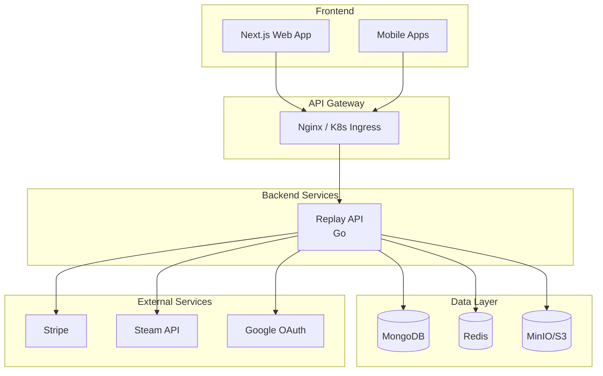

### Request Flow

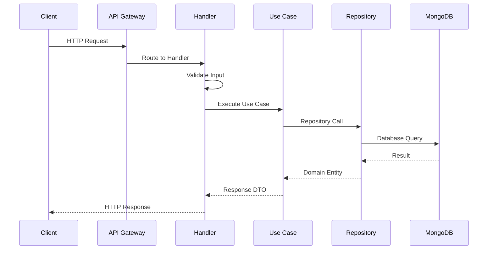

---

## Domain Layer

### Core Domains

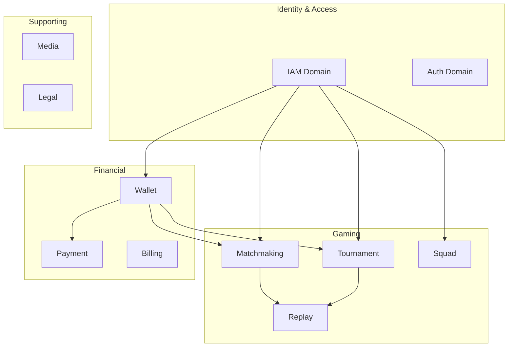

### Domain Structure

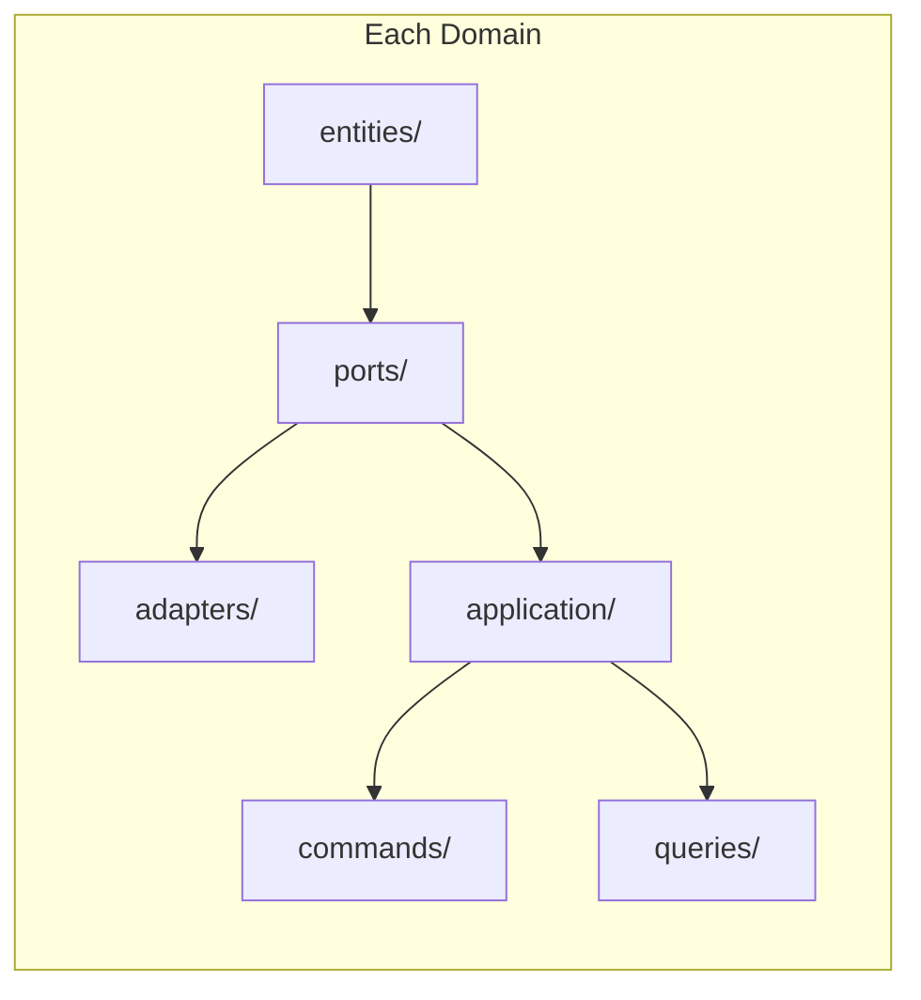

### Matchmaking Entities

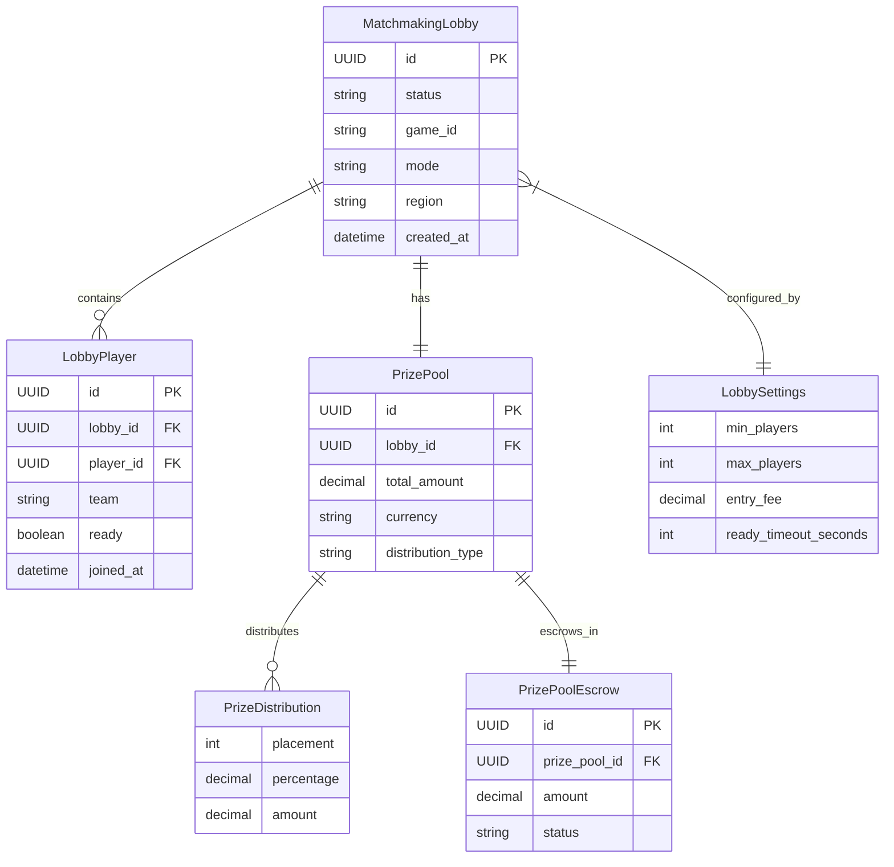

### Wallet Entities

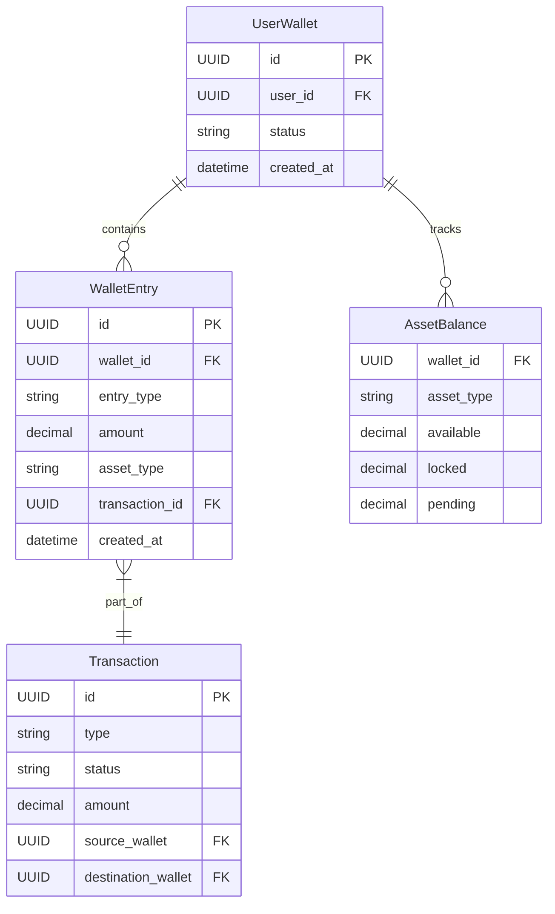

### Tournament Entities

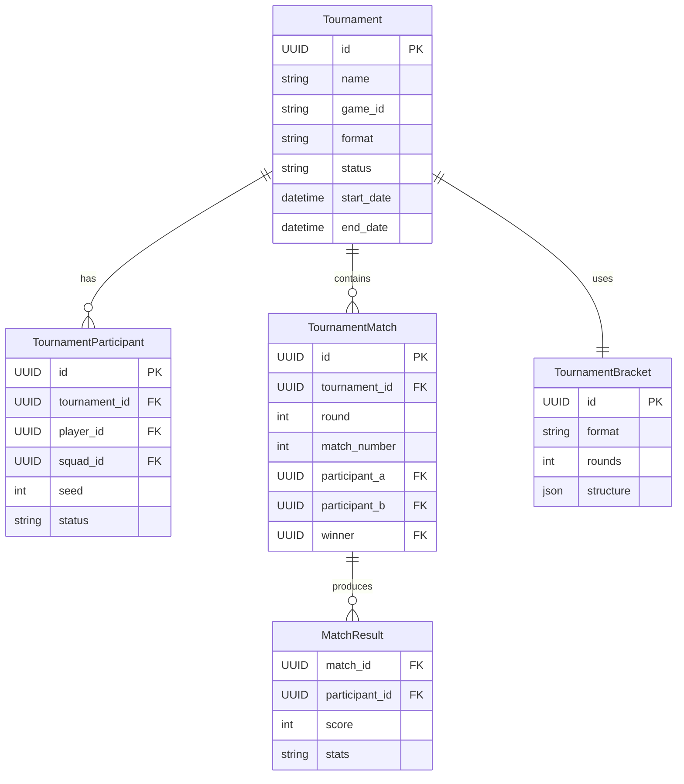

---

## Data Flow

### Authentication Flow

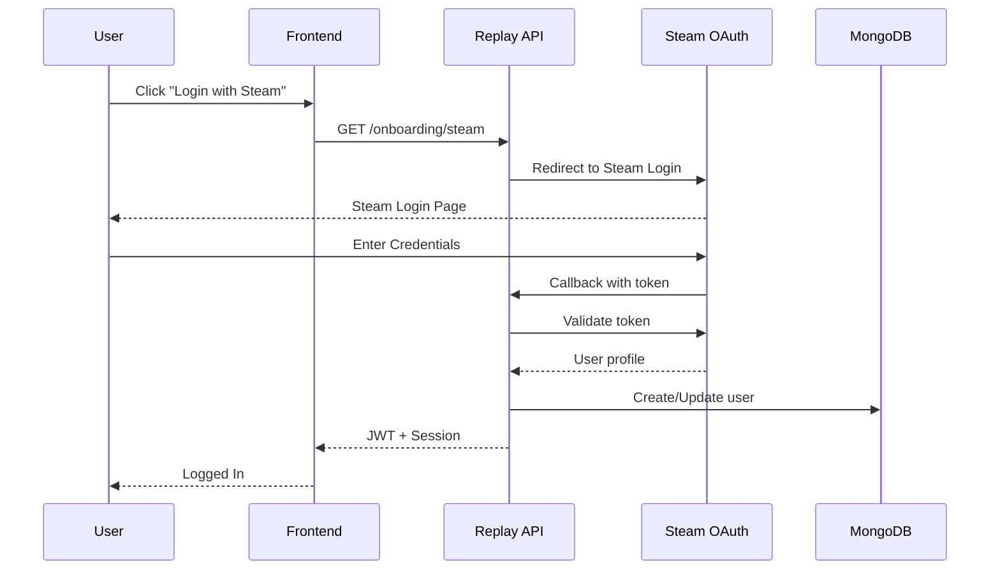

### Lobby Creation Flow

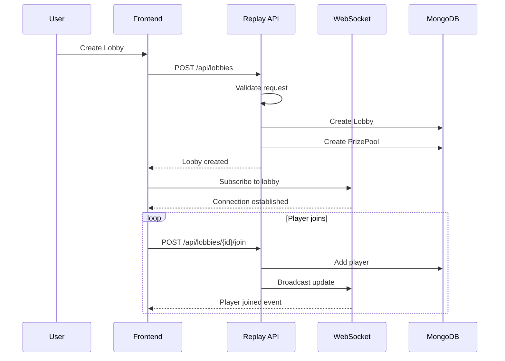

### Payment Flow

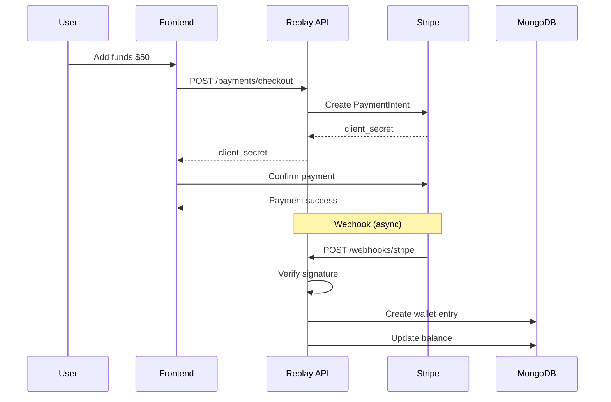

### Prize Distribution Flow

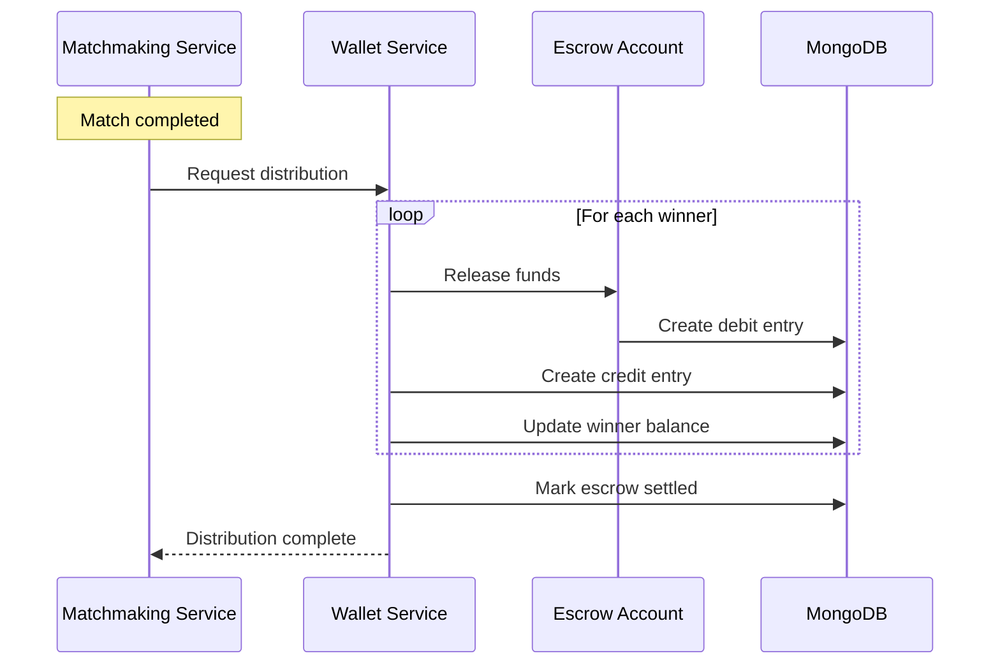

---

## Infrastructure

### Kubernetes Deployment

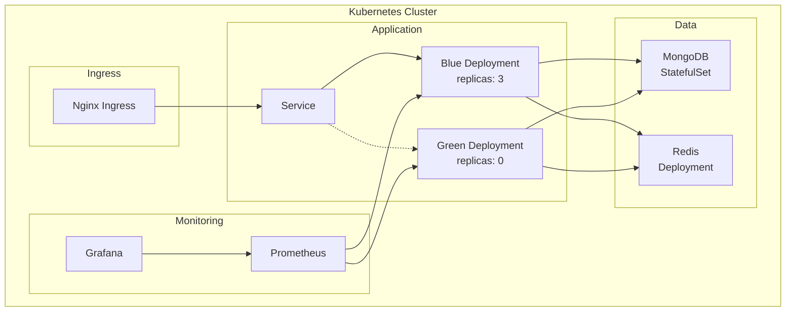

### Local Development

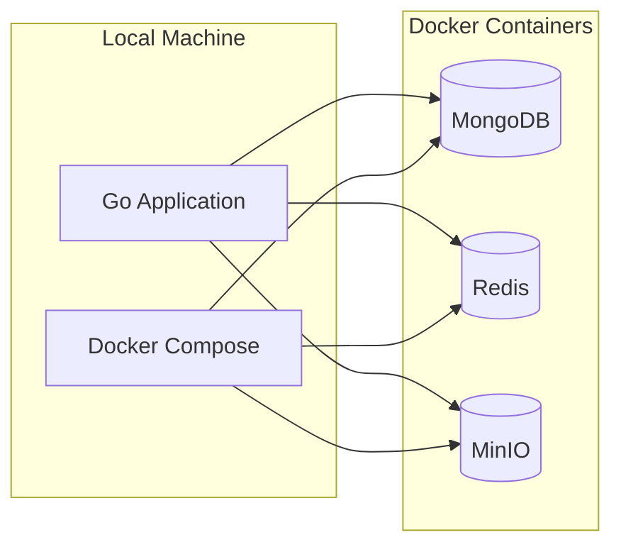

### CI/CD Pipeline

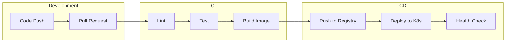

---

## Component Interaction

### Handler to Repository

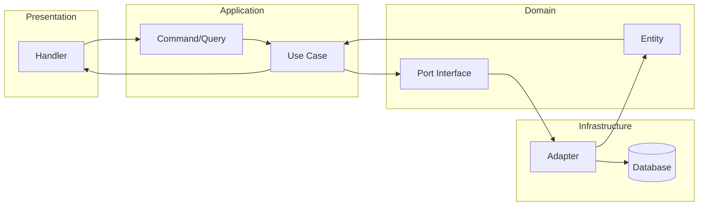

### Event-Driven Communication

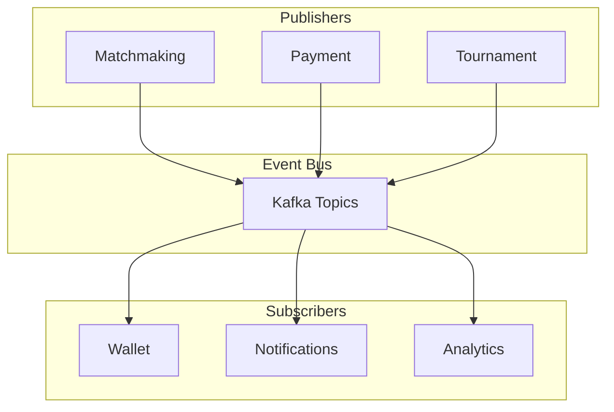

---

**Last Updated**: November 2025
